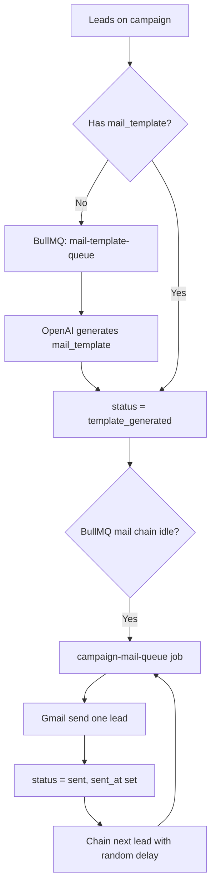

# Campaign flows — manual vs auto (complete guide)

This document describes how campaigns work in **Lead-Gen-backend** today: API steps, worker behavior, statuses, and follow-ups.

> **`run_mode` drives the pipeline:** `auto` + `active` enqueues template jobs on bulk add and activation; `manual` + `active` does not — use **`POST /api/campaigns/:id/leads/run`** to generate templates and send one lead at a time.

---

## Prerequisites (both flows)

| Requirement | Why |
|-------------|-----|
| User authenticated (Bearer JWT) | All campaign routes use `authenticate` |
| Google linked (`GET /api/auth/google`) | Outbound mail uses Gmail API |
| Supabase schema up to date | `campaigns`, `campaign_leads`, `leads_data`, follow-up tables |
| Redis + BullMQ workers | Template generation, sending, follow-up scheduler |
| `OPENAI_API_KEY` | AI per-lead `mail_template` on initial emails |

**Processes to run locally**

```bash
# API
npm run dev

# Workers (separate terminals OR set RUN_WORKERS_IN_WEB=1)
node src/workers/mailTemplateWorker.js
node src/workers/campaignMailWorker.js
node src/workers/followUpSchedulerWorker.js
```

On Render: web + `mail-template-worker` + `campaign-mail-worker` + `follow-up-scheduler-worker` + Redis (`render.yaml`).

---

## Concepts

### Campaign `status`

| Status | Meaning |
|--------|---------|
| `draft` | Config only. **Cannot** bulk-add or auto-assign leads. |
| `active` | Leads can be added; templates enqueue on add/activate; mail can send. |
| `paused` | Leads can still be added; **no** initial or follow-up sends (mail workers skip). |
| `completed` | Leads can still be added; **no** initial or follow-up sends. |

### Campaign lead `status` (initial email)

```
pending → template_generated → sent
              ↓                    ↓
           failed / skipped    failed (retry via send)
```

| Status | Meaning |
|--------|---------|
| `pending` | Lead assigned; no AI template yet (or empty template). |
| `template_generated` | `mail_template` saved; ready to send. |
| `sent` | Initial Gmail sent; `sent_at` set. |
| `failed` | Template or send failed (`error_message`). |
| `skipped` | No email in `leads_data`. |

### `run_mode`

| Value | Backend behavior |
|-------|------------------|
| `auto` | When campaign is **`active`**, bulk add / activation enqueue BullMQ template jobs → worker generates templates → mail worker sends sequentially. |
| `manual` | Bulk add does **not** auto-enqueue. Call **`POST /api/campaigns/:id/leads/run`** to process `pending` / `template_generated` leads (template + send, one by one). |
| `scheduled` | **Not implemented** for `run_mode`; follow-ups still use the 6h scheduler. |

---

## Shared pipeline (after leads exist)



**Template enqueue triggers**

- `PATCH /api/campaigns/:id` → `status: active` (first time): all `pending` leads without template.
- `POST .../leads/bulk` while campaign is `active`: each newly inserted lead.
- Auto-assign on create (if env + active): each inserted lead.

**Mail send triggers** (campaign must be **`active`**)

- **Automatic (worker):** After a template job succeeds, if the campaign is `active` and no mail job is waiting/active, the template worker enqueues the first `campaign-mail-queue` job. The mail worker sends one lead, then chains the next `template_generated` lead with `MAIL_DELAY_MIN_MS`–`MAIL_DELAY_MAX_MS` delay (default 3–5 minutes). If the campaign is `paused` or `completed`, workers skip sending and do not chain further mail jobs.
- **Manual (HTTP):** `POST /api/campaigns/:id/leads/send-emails` returns **400** `CAMPAIGN_NOT_ACTIVE` unless the campaign is `active`.

**Follow-ups:** Scheduler and per-send logic only run for **`active`** campaigns (unchanged).

**Daily cap:** 500 sends per user per UTC day (initial + follow-up emails combined).

---

## Manual campaign flow

Use this when the user **chooses specific leads** (`lead_data_id` list) and may step through draft → active → send explicitly.

### Step 0 — Auth & Google

1. `POST /api/auth/signup` or `POST /api/auth/login` → access token.
2. `GET /api/auth/google` → complete OAuth → row in `google_accounts`.

### Step 1 — Create campaign (usually `draft`)

`POST /api/campaigns`

```json
{
  "name": "Q2 outbound",
  "goal": "Book demos",
  "target_zone": "US",
  "call_to_action": "Reply for a call",
  "run_mode": "manual",
  "target_tone": "Professional",
  "target_leads": 0,
  "lead_source": "both",
  "status": "draft",
  "mail_training_instruction": "Keep under 120 words.",
  "mail_template_samples": [
    { "subject": "Quick intro", "body": "Hi, we help teams..." }
  ],
  "sender_display_name": "Alex",
  "sender_address": "123 Main St",
  "sender_phone": "+1 555 0100"
}
```

### Step 2 — Activate campaign

`PATCH /api/campaigns/:id`

```json
{ "status": "active" }
```

Response may include `data.activation`: `{ enqueued, skippedDuplicate, skippedWrongState, examined }`.

If leads were already added while `draft`, activation enqueues template jobs for `pending` leads with empty `mail_template`.

### Step 3 — Add leads (hand-picked)

Campaign must be `active`, `paused`, or `completed` (not `draft`).

`POST /api/campaigns/:id/leads/bulk`

```json
{
  "leads": [
    { "lead_data_id": "12345" },
    { "lead_data_id": "67890" }
  ]
}
```

- Inserts `campaign_leads` with `status: pending`.
- If campaign is `active`, enqueues one template job per new lead.
- Duplicates `(campaign_id, lead_data_id)` are skipped.

### Step 4 — Wait for templates (worker)

- **mail-template-worker** runs OpenAI → writes `campaign_leads.mail_template` → `template_generated`.
- First completed template may start the **mail worker chain** automatically.

Optional manual trigger (all pending leads or one lead):

`POST /api/campaigns/:id/leads/generate-templates`

```json
{}
```

or `{ "campaign_lead_id": "<uuid>" }`.

### Step 5 — Send initial emails

**Option A — Workers (hands-off after templates)**  
Ensure `campaign-mail-worker` is running. Mail sends sequentially with delays; watch SSE or DB.

**Option B — HTTP batch send**

`POST /api/campaigns/:id/leads/send-emails`

```json
{}
```

Optional: `{ "campaign_lead_id": "<uuid>" }`. Gmail token is read from the linked Google account (not sent in the body).

Sends leads in `pending` / `template_generated` / `failed` that have a non-empty `mail_template` (up to daily limit).

### Step 6 — Monitor progress (optional)

1. `POST /api/campaigns/:id/events/session` → `sid`
2. `GET /api/campaigns/:id/events?sid=...` (SSE): `template_started`, `template_done`, `mail_sent`, `mail_failed`, `campaign_progress`.

### Step 7 — Follow-ups (optional)

1. `POST /api/campaigns/:id/follow-ups` for each step:

```json
{
  "name": "Follow-up 1",
  "waiting_days": 1,
  "body_template": "Subject: Checking in\n\nHi {{firstName}},\n\nFollowing up on my note."
}
```

2. After leads are `sent` with `sent_at`, **follow-up-scheduler-worker** runs every 6 hours (`FOLLOW_UP_CRON`, default `0 */6 * * *`).
3. Due when `now >= sent_at + waiting_days` (calendar days from **first** send).
4. Plain-text only; tracked in `campaign_lead_follow_ups` (no duplicate sends).

### Manual flow checklist

| # | Action | API / system |
|---|--------|----------------|
| 1 | Login + Google | Auth routes |
| 2 | Create campaign `draft`, `run_mode: manual` | `POST /campaigns` |
| 3 | Activate | `PATCH /campaigns/:id` `{ "status": "active" }` |
| 4 | Bulk add chosen `lead_data_id`s | `POST .../leads/bulk` |
| 5 | Templates | Workers or `POST .../generate-templates` |
| 6 | Send | Workers or `POST .../send-emails` |
| 7 | Follow-ups | `POST .../follow-ups` + scheduler worker |

---

## Auto campaign flow

Use this when the server should **pick leads from the pool** and (with workers) run template → send with minimal HTTP calls.

Requires server env:

```env
CAMPAIGN_ACTIVE_CREATE_AUTO_ASSIGN=1
```

### Step 0 — Same prerequisites as manual

Auth, Google, Redis, workers, OpenAI.

### Step 1 — Create campaign already `active` with `target_leads`

`POST /api/campaigns`

```json
{
  "name": "Auto pool outreach",
  "goal": "Book demos",
  "target_zone": "US",
  "call_to_action": "Reply for a call",
  "run_mode": "auto",
  "target_tone": "Professional",
  "target_leads": 50,
  "lead_source": "both",
  "status": "active",
  "mail_training_instruction": "...",
  "mail_template_samples": []
}
```

**If `CAMPAIGN_ACTIVE_CREATE_AUTO_ASSIGN=1`:**

- Server calls `assignRandomLeadsToCampaign`:
  - Reads up to `target_leads` random rows from `leads_data` (filtered by `lead_source`: `new` | `old` | `both`).
  - Excludes leads already on the campaign.
  - Inserts `campaign_leads` (`pending`).
  - Enqueues template job per inserted lead (campaign is `active`).
- Response includes `data.autoAssign`: `{ totalInserted, totalDuplicates, leadSource, ... }` or `{ error }`.

You can still set `run_mode: "auto"` without the env flag — then you must assign leads another way (bulk or future assign endpoint).

> There is no public `POST .../assign` route today; random assign runs only via create + env or internal service call.

### Step 2 — Templates (automatic)

Same as manual: **mail-template-worker** processes `mail-template-queue`.

### Step 3 — Send (automatic chain)

When the first template completes and no mail job is active for the campaign, **mail-template-worker** enqueues **campaign-mail-worker**, which:

1. Sends one `template_generated` lead via Gmail.
2. Sets `sent` + `sent_at`.
3. Enqueues next lead after random delay.
4. Repeats until no `template_generated` leads remain.

You do **not** need `POST .../send-emails` unless workers are down or you want a one-shot HTTP send.

### Step 4 — Follow-ups

Same as manual (Steps 7): configure follow-ups; scheduler sends after `waiting_days` from initial `sent_at`.

### Auto flow checklist

| # | Action | API / system |
|---|--------|----------------|
| 1 | Set `CAMPAIGN_ACTIVE_CREATE_AUTO_ASSIGN=1` | `.env` / Render |
| 2 | Login + Google | Auth |
| 3 | Create `status: active`, `target_leads > 0`, `run_mode: auto` | `POST /campaigns` → `autoAssign` |
| 4 | Templates + send | Workers (template → mail chain) |
| 5 | Follow-ups | `POST .../follow-ups` + scheduler worker |

---

## Side-by-side comparison

| Topic | Manual campaign | Auto campaign |
|-------|-----------------|---------------|
| **Lead selection** | Client sends `lead_data_id` list (`bulk`) | Server random from `leads_data` (env on create) |
| **Typical create `status`** | `draft` → later `active` | `active` immediately |
| **`target_leads`** | Optional (0 if only bulk add) | Required > 0 for auto-assign |
| **Env flag** | Not required | `CAMPAIGN_ACTIVE_CREATE_AUTO_ASSIGN=1` |
| **Template generation** | On activate / bulk add / worker | On create assign / worker |
| **Initial send** | Worker chain and/or `send-emails` ( **`active` only** ) | Worker chain (typical, **`active` only** ) |
| **`run_mode` field** | `manual` (label) | `auto` (label) |

### Send eligibility by campaign status

| Status | Initial email | Follow-up email |
|--------|---------------|-----------------|
| `draft` | No | No |
| `active` | Yes | Yes (when due) |
| `paused` | No | No |
| `completed` | No | No |

HTTP `send-emails` on a non-active campaign returns **400** with `code: CAMPAIGN_NOT_ACTIVE`.

---

## API reference (campaign-related)

| Method | Path | Purpose |
|--------|------|---------|
| `POST` | `/api/campaigns` | Create |
| `GET` | `/api/campaigns` | List |
| `GET` | `/api/campaigns/:id` | Get one |
| `PATCH` | `/api/campaigns/:id` | Update / activate |
| `DELETE` | `/api/campaigns/:id` | Delete |
| `POST` | `/api/campaigns/:id/leads/bulk` | Add specific leads |
| `GET` | `/api/campaigns/:id/leads` | List leads |
| `PATCH` | `/api/campaigns/:id/leads/:leadId` | Update lead row |
| `DELETE` | `/api/campaigns/:id/leads/:leadId` | Remove lead |
| `POST` | `/api/campaigns/:id/leads/generate-templates` | OpenAI templates (sync HTTP) |
| `POST` | `/api/campaigns/:id/leads/send-emails` | Gmail send loop (HTTP) |
| `POST` | `/api/campaigns/:id/follow-ups` | Create follow-up step |
| `GET` | `/api/campaigns/:id/follow-ups` | List follow-ups |
| `POST` | `/api/campaigns/:id/events/session` | SSE session |
| `GET` | `/api/campaigns/:id/events?sid=` | SSE stream |

Interactive docs: `GET /api/docs` (Swagger UI).

---

## Environment variables (campaigns)

| Variable | Default | Effect |
|----------|---------|--------|
| `CAMPAIGN_ACTIVE_CREATE_AUTO_ASSIGN` | off | Random lead assign on create when `active` + `target_leads > 0` |
| `RUN_WORKERS_IN_WEB` | on in dev | Start template + mail + follow-up workers inside API process |
| `MAIL_DELAY_MIN_MS` / `MAIL_DELAY_MAX_MS` | 180000–300000 | Delay between sequential sends |
| `FOLLOW_UP_CRON` | `0 */6 * * *` | Follow-up scan schedule |
| `OPENAI_API_KEY` | — | Template generation |
| `REDIS_HOST` / `REDIS_URL` | — | BullMQ + SSE |

---

## Example timeline (auto, 5 leads, 2 follow-ups)

| Day | Event |
|-----|--------|
| 0 | Create campaign `active`, `target_leads: 5` → 5 leads assigned |
| 0 | Workers generate templates; mail chain sends 4 (`sent`), 1 fails/skips |
| 0 | `POST` follow-ups: `waiting_days: 1` and `3` with `body_template` |
| 1+ | Scheduler sends follow-up #1 to the 4 `sent` leads (once each) |
| 3+ | Scheduler sends follow-up #2 to the same 4 (once each) |

---

## Troubleshooting

| Symptom | Check |
|---------|--------|
| Bulk add 400 “draft” | `PATCH` campaign to `active` first |
| No templates | `mail-template-worker` running; `OPENAI_API_KEY`; lead `pending` |
| No emails | `campaign-mail-worker`; Google linked; lead `template_generated` |
| `send-emails` 404 | Run `generate-templates` first; lead needs `mail_template` |
| Auto assign empty | `leads_data` pool; `lead_source`; `target_leads > 0`; env flag |
| Follow-ups not sent | Migration applied; `body_template` set; campaign `active`; lead `sent`; scheduler worker |
| Duplicate follow-ups | Should not happen — `campaign_lead_follow_ups` unique constraint |

---

## Related docs

- `docs/CAMPAIGN-E2E-CHECKLIST.md` — short QA checklist
- `sql/schema.sql` — tables and migrations
- `env.example` — all env vars
